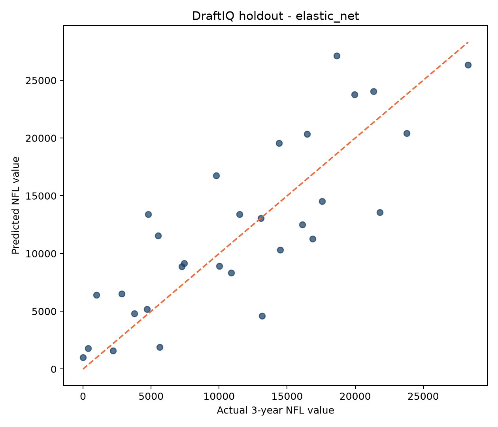
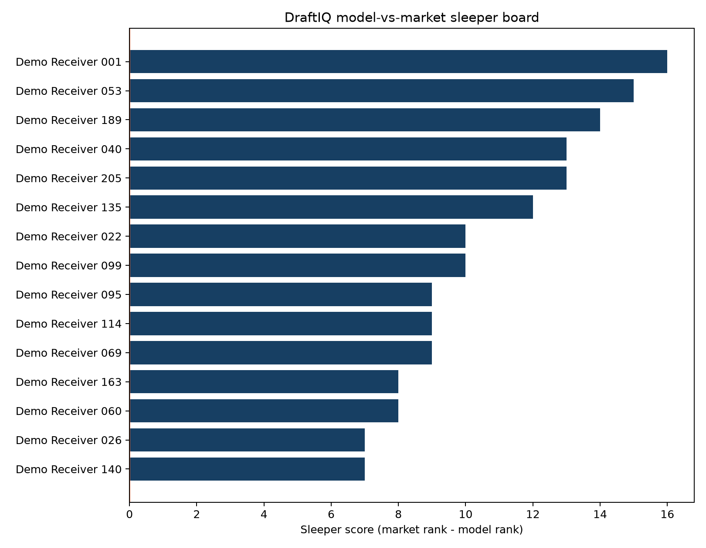

# DraftIQ 🏈

**NFL Wide Receiver Draft Prospect & Sleeper Model**

DraftIQ is an end-to-end football analytics project designed to identify wide receiver prospects whose production and athletic profiles historically translate to NFL value — especially players the draft market may be undervaluing.

> **Decision question:** Which WR prospects are likely to outperform their draft position, and what parts of their profile drive that projection?

[](https://github.com/paarthkeswani-droid/DraftIQ/actions/workflows/ci.yml)

## Portfolio demo

DraftIQ includes a deterministic **synthetic** data generator, making the complete workflow reviewable without downloading or redistributing proprietary prospect data.

```bash
pip install -r requirements.txt
make demo
streamlit run app.py
```

The demo creates 210 fictional WR prospects across seven draft classes, joins their first three synthetic NFL seasons, engineers production-share and athletic features, compares Elastic Net and Gradient Boosting, holds out the entire 2024 class for time-based evaluation, and builds a model-vs-market sleeper board.

### Example results

On the committed synthetic demo, Elastic Net was selected by cross-validation and achieved **3,960 MAE**, **4,813 RMSE**, and **0.59 R-squared** on the held-out 2024 draft class. These numbers demonstrate the pipeline and should not be interpreted as real-world model performance.

| Time-based holdout | Model-vs-market sleeper board |
|---|---|
|  |  |

Explore the generated [model metrics](outputs/model_metrics.json), [feature importance](outputs/feature_importance.csv), [WR rankings](outputs/wr_rankings.csv), and [similarity results](outputs/similar_players.csv). The Streamlit dashboard adds an interactive class-specific sleeper board, prospect explorer, and feature-intelligence view.


## What this project demonstrates

- Reproducible public-data ingestion from the nflverse ecosystem
- Python, pandas and feature engineering
- SQL scouting queries with SQLite
- Predictive modeling with `scikit-learn`
- Out-of-sample model evaluation
- Model-vs-market sleeper/reach analysis
- Historical player similarity
- Explainable visual scouting outputs

## Project structure

```text
DraftIQ/
├── data/
│   ├── raw/                 # optional supplemental inputs (gitignored)
│   └── processed/           # generated modeling tables (gitignored)
├── outputs/
├── sql/
│   └── scouting_queries.sql
├── src/
│   ├── download_data.py
│   ├── build_dataset.py
│   ├── features.py
│   ├── model.py
│   └── similarities.py
├── tests/
│   └── test_features.py
├── .gitignore
├── LICENSE
├── Makefile
├── requirements.txt
└── README.md
```

## Public data

DraftIQ is built around **nflverse**, an open football-data ecosystem. The downloader uses public nflverse release files for draft picks, player metadata and seasonal NFL receiving statistics. A supplemental college WR CSV can be added at `data/raw/college_wr.csv` to incorporate college production/athletic testing.

The project intentionally keeps generated/raw datasets out of git. This makes the repository lightweight and avoids redistributing data unnecessarily.

### Supplemental college WR schema

Recommended columns:

`player, draft_year, age, height_in, weight_lb, games, receptions, rec_yards, rec_tds, team_pass_yards, team_pass_tds, forty, vertical, broad_jump`

Optional fields such as `college`, `conference`, `targets`, `routes`, `bench` and `three_cone` are preserved when present.

If supplemental college data is unavailable, the project still builds a draft-market baseline from nflverse and NFL outcomes. Adding college production turns it into the full sleeper model.

## Outcome definition

DraftIQ measures early NFL receiving value using the first three professional seasons after a receiver is drafted. The default target combines:

- receiving yards
- receiving touchdowns
- receptions

The formula is deliberately transparent and configurable in `src/build_dataset.py`.

## Feature engineering

College/athletic features include:

- receiving yards per game
- receptions per game
- touchdown share (when team totals are available)
- receiving yard share (when team totals are available)
- yards per reception
- age
- height and weight
- 40-yard dash
- vertical jump
- broad jump
- BMI
- speed score

`draft_pick` is **not** included in the default predictive feature set. That is intentional: the project wants an independent football-data estimate that can be compared against the draft market afterward.

## Modeling

The pipeline compares:

1. **Elastic Net** for an interpretable regularized baseline.
2. **Gradient Boosting Regressor** for nonlinear relationships and interactions.

Models are evaluated with cross-validation and a held-out test set using MAE, RMSE and R². The selected model produces a predicted NFL value score and percentile prospect grade.

## Sleeper score

After prediction, DraftIQ compares model rank with actual draft rank:

```text
Sleeper Score = Draft Market Rank - Model Rank
```

A large positive value means the model believes the player should have been selected earlier than the market did. A negative value flags potential overvaluation.

This framing makes the project useful in an interview because it directly supports a personnel decision instead of merely predicting statistics.

## Historical comparisons

`src/similarities.py` standardizes production and athletic features and returns the closest historical WR profiles using cosine similarity.

Example output:

```text
Prospect: Example WR
Model Grade: 88 / 100
Model Rank: 7
Draft Market Rank: 18
Sleeper Score: +11

Closest historical profiles:
1. Receiver A — 0.91 similarity
2. Receiver B — 0.87 similarity
3. Receiver C — 0.84 similarity
```

These are statistical comps, not claims that players have identical film or career outcomes.

## Quick start

```bash
python -m venv .venv
source .venv/bin/activate          # Windows: .venv\Scripts\activate
pip install -r requirements.txt

python src/download_data.py
python src/build_dataset.py
python src/model.py
python src/similarities.py --player "PLAYER NAME"
```

Or:

```bash
make all
```

## Outputs

- `data/processed/wr_model_data.csv` — modeling dataset
- `outputs/model_metrics.json` — holdout performance
- `outputs/wr_rankings.csv` — predicted NFL value, model rank and sleeper score
- `outputs/feature_importance.csv` — model explanation
- `outputs/predicted_vs_actual.png` — model evaluation
- `outputs/sleeper_board.png` — top model-vs-market values
- `outputs/similar_players.csv` — historical comps

## SQL scouting layer

`sql/scouting_queries.sql` includes example personnel questions:

- biggest historical sleepers
- productive young WRs drafted outside Round 1
- athletic outliers with strong production
- players the model ranked materially above/below the draft market

## Scouting insights

DraftIQ is designed to support a workflow like this:

1. **Model flag:** Identify prospects with strong model-vs-market gaps.
2. **Profile diagnosis:** Determine whether the signal comes from age, production, athleticism or multiple dimensions.
3. **Historical comps:** Inspect similar past prospects.
4. **Film/context follow-up:** Review route tree, releases, hands, coverage faced, quarterback/offense context and medical information.

A model flag is the beginning of a scouting question, not the end of one.

## Limitations

- Public college football data coverage is less standardized than NFL play-by-play data.
- Combine/pro-day participation creates missing values and selection effects.
- College offensive scheme and quarterback quality affect production.
- Box-score features cannot directly measure route running, separation process, release package, catch technique or blocking.
- NFL opportunity is partly determined by draft capital, coaching and injuries.
- Historical relationships may shift as offensive styles change.

## Next improvements

- Add route-level data where legally/publicly available
- Build separate archetype clusters (X, Z, slot)
- Use draft-class/time-based validation
- Add uncertainty intervals
- Incorporate expected draft position rather than actual draft position for live prospect evaluation
- Build a Streamlit interactive draft board

## Resume bullets

- **Built DraftIQ, a Python/SQL NFL wide receiver scouting pipeline using public nflverse data and college prospect features to predict early-career receiving value and identify draft sleepers.**
- **Engineered age-adjusted production, market-share and athletic metrics; compared Elastic Net and Gradient Boosting models using cross-validation and held-out MAE/RMSE/R².**
- **Created a model-vs-market sleeper score, historical similarity engine and scouting visualizations that translate statistical predictions into actionable player-personnel questions.**

## Responsible use

DraftIQ is an educational/portfolio project and is not affiliated with the NFL, NCAA or nflverse. Public-data models are incomplete estimates and should not be represented as official scouting grades.

## License

MIT
